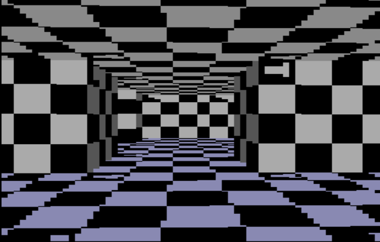
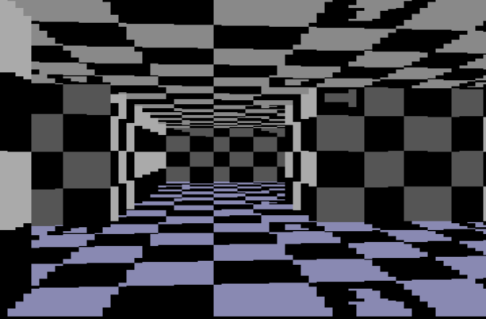

# [Raycast Engine C++](https://github.com/Gvln-S/Raycast-Engine.git)

A high-performance pseudo-3D rendering engine written in **C++** using the **Raycasting** technique, inspired by retro classics like *Wolfenstein 3D*. This project implements a ray-projection system to simulate three-dimensional environments from a two-dimensional map.


## Screenshots

Below is the engine in action, showcasing texture rendering:

| img 1 | img 2 |
| :---: | :---: |
|  |  |

## Key Features

* **Pseudo-3D Rendering**: Implementation of raycasting algorithms for wall generation with "fisheye" effect correction.
* **Texture Mapping**: Support for multiple integrated textures (bricks, checkers, windows, and doors) applied to walls, floors, and ceilings.
* **Interactive Environment**: Real-time collision system and the ability to interact with map elements, such as opening doors.
* **Dual View**: Includes a real-time 2D minimap for debugging and player navigation.
* **Fluid Control**: FPS-based movement to ensure a consistent experience regardless of processing power.

## Technical Details

The engine utilizes the **FreeGLUT** library for window management and input, alongside **OpenGL** for drawing primitives.

* **Language**: C++17.
* **Mathematics**: Intensive use of trigonometry for calculating horizontal and vertical ray intersections.
* **Dynamic Shading**: Wall shading based on orientation (vertical vs. horizontal) to add visual depth.

## Controls

| Key | Action |
| :---: | :--- |
| `W` / `S` | Move Forward / Backward |
| `A` / `D` | Strafe Left / Right |
| `Mouse` | Rotate Camera (Look around) |
| `E` | Interact (Open Doors) |

## Installation and Building

### Prerequisites
* C++17 compatible compiler (GCC/Clang/MSVC).
* **CMake** (version 3.15 or higher).
* Installed libraries: `freeglut`, `opengl32`, `glu32`.

### Build Instructions
1.  **Clone the repository**:
    ```bash
    git clone https://github.com/Gvln-S/raycast-engine.git
    cd raycast-engine
    ```
2.  **Configure the project with CMake**:
    > **Note**: Ensure you review the `include_directories` paths in `CMakeLists.txt` if you are using a custom MinGW installation.
    ```bash
    mkdir build && cd build
    cmake ..
    ```
3.  **Compile and Run**:
    ```bash
    make
    ./Raycast-Engine
    ```

**Linux - Debian**
```bash
sudo apt install build-essential cmake

mkdir build
cd build
cmake ..
make
./Raycast-Engine
```

**Mac**
```bash
xcode-select --install
brew install cmake
    
mkdir build
cd build
cmake ..
make
./Raycast-Engine
```

## Contributions and Personalization

This is an open project for learning and experimentation. **You are more than welcome to fork this repository!** Feel free to add new textures, implement a complex lighting systems, or even add enemies. If you want to customize it to your tastes or add something new, contributions are always appreciated.

---
*Developed with a passion for computer graphics and classic game engines.*
